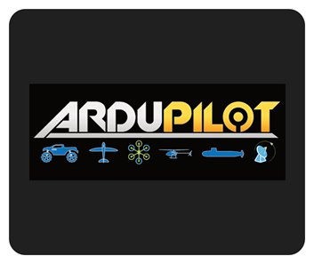

# Using the Ardupilot Simulation



For more inforamtion about ardupilot go to:
https://ardupilot.org/


## Install Ubuntu 22.04.5

https://releases.ubuntu.com/jammy/

Command to update ubuntu.
```
sudo apt update 
sudo apt upgrade 
```

## Set up the Ardupilot Build Environment

https://ardupilot.org/dev/docs/building-setup-linux.html#building-setup-linux

Instal Git
```
sudo apt-get install git
```

Clone the ardupilot repo
```
git clone --recurse-submodules https://github.com/ArduPilot/ardupilot.git
cd ardupilot
```

Form the cloned repository install ardupilot required packages 

```
Tools/environment_install/install-prereqs-ubuntu.sh -y
```

Reload the path

```
. ~/.profile
```

Build the Code 
```
./waf configure --board Pixhawk6c
./waf rover
```

## Install ROS2

https://docs.ros.org/en/humble/Installation/Ubuntu-Install-Debs.html

### Setup instructions from the ROS2 website
Set locale
```
locale  # check for UTF-8

sudo apt update && sudo apt install locales

sudo locale-gen en_US en_US.UTF-8

sudo update-locale LC_ALL=en_US.UTF-8 LANG=en_US.UTF-8

export LANG=en_US.UTF-8

locale  # verify settings
```
First ensure that the Ubuntu Universe repository is enabled.

```
sudo apt install software-properties-common
sudo add-apt-repository universe
```

ROS 2 apt repository

```
sudo apt update && sudo apt install curl -y

export ROS_APT_SOURCE_VERSION=$(curl -s https://api.github.com/repos/ros-infrastructure/ros-apt-source/releases/latest | grep -F "tag_name" | awk -F\" '{print $4}')

curl -L -o /tmp/ros2-apt-source.deb "https://github.com/ros-infrastructure/ros-apt-source/releases/download/${ROS_APT_SOURCE_VERSION}/ros2-apt-source_${ROS_APT_SOURCE_VERSION}.$(. /etc/os-release && echo $VERSION_CODENAME)_all.deb" # If using Ubuntu derivates use $UBUNTU_CODENAME

sudo dpkg -i /tmp/ros2-apt-source.deb
```

Update your apt repository caches

```
sudo apt update
sudo apt upgrade
```

Desktop Install

```
sudo apt install ros-humble-desktop
```
Development tools

```
sudo apt install ros-dev-tools
```
Sourcing the setup script

```
Sourcing the setup script
```

### ROS2 Test code 
Talker Node 

```
source /opt/ros/humble/setup.bash
ros2 run demo_nodes_cpp talker
```

Listener Node

```
source /opt/ros/humble/setup.bash
ros2 run demo_nodes_py listener
```

## ROS2 Workspace Setup 

https://ardupilot.org/dev/docs/ros2.html


Clone the required repositories using vcs and a ros2.repos files.

```
mkdir -p ~/ardu_ws/src
cd ~/ardu_ws
vcs import --recursive --input  https://raw.githubusercontent.com/ArduPilot/ardupilot/master/Tools/ros2/ros2.repos src
```

Init rosdep

```
sudo rosdep init
rosdep update
```

Update all dependencies.

```
cd ~/ardu_ws
sudo apt update
rosdep update
source /opt/ros/humble/setup.bash
rosdep install --from-paths src --ignore-src -r -y
```

Installing the MicroXRCEDDSGen build dependency.

```
sudo apt install default-jre
cd ~/ardu_ws
git clone --recurse-submodules https://github.com/ardupilot/Micro-XRCE-DDS-Gen.git
cd Micro-XRCE-DDS-Gen
./gradlew assemble
echo "export PATH=\$PATH:$PWD/scripts" >> ~/.bashrc
```

Test microxrceddsgen installation.

```
source ~/.bashrc
microxrceddsgen -help
# microxrceddsgen usage:
#     microxrceddsgen [options] <file> [<file> ...]
#     where the options are:
#             -help: shows this help
#             -version: shows the current version of eProsima Micro XRCE-DDS Gen.
#             -example: Generates an example.
#             -replace: replaces existing generated files.
#             -ppDisable: disables the preprocessor.
#             -ppPath: specifies the preprocessor path.
#             -I <path>: add directory to preprocessor include paths.
#             -d <path>: sets an output directory for generated files.
#             -t <temp dir>: sets a specific directory as a temporary directory.
#             -cs: IDL grammar apply case sensitive matching.
#     and the supported input files are:
#     * IDL files.
```

Build the Workspace
 
```
cd ~/ardu_ws
colcon build --packages-up-to ardupilot_dds_tests
```

ArduPilot ROS 2 installation test

```
cd ~/ardu_ws
source ./install/setup.bash
colcon test --executor sequential --parallel-workers 0 --base-paths src/ardupilot --event-handlers=console_cohesion+
colcon test-result --all --verbose
```

## ROS 2 with SITL

https://ardupilot.org/dev/docs/ros2-sitl.html

Run ROS2 with SITL simulator 

```
source /opt/ros/humble/setup.bash
cd ~/ardu_ws/
colcon build --packages-up-to ardupilot_sitl
source install/setup.bash
ros2 launch ardupilot_sitl sitl_dds_udp.launch.py transport:=udp4 synthetic_clock:=True wipe:=False model:=quad speedup:=1 slave:=0 instance:=0 defaults:=$(ros2 pkg prefix ardupilot_sitl)/share/ardupilot_sitl/config/default_params/copter.parm,$(ros2 pkg prefix ardupilot_sitl)/share/ardupilot_sitl/config/default_params/dds_udp.parm sim_address:=127.0.0.1 master:=tcp:127.0.0.1:5760 sitl:=127.0.0.1:5501
```

Once everything is running, you can now interact with ArduPilot through the ROS2 CLI. 

```
source ~/ardu_ws/install/setup.bash
# See the node appear in the ROS graph
ros2 node list
# See which topics are exposed by the node
ros2 node info /ap
# Echo a topic published from ArduPilot
ros2 topic echo /ap/geopose/filtered
```

Can launch mavproxy in another terminal aswell

```
mavproxy.py --console --map --aircraft test --master=:14550
```

## ROS 2 with Gazebo

https://ardupilot.org/dev/docs/ros2-gazebo.html

### Install gazebo 

https://gazebosim.org/docs/harmonic/install_ubuntu/

First install some necessary tools.

```
sudo apt-get update
sudo apt-get install curl lsb-release gnupg
```

Then install Gazebo Harmonic.

```
sudo curl https://packages.osrfoundation.org/gazebo.gpg --output /usr/share/keyrings/pkgs-osrf-archive-keyring.gpg
echo "deb [arch=$(dpkg --print-architecture) signed-by=/usr/share/keyrings/pkgs-osrf-archive-keyring.gpg] https://packages.osrfoundation.org/gazebo/ubuntu-stable $(lsb_release -cs) main" | sudo tee /etc/apt/sources.list.d/gazebo-stable.list > /dev/null
sudo apt-get update
sudo apt-get install gz-harmonic
```

Install ros_gz from the non official binary packages from apt.

https://gazebosim.org/docs/all/ros_installation/

```
sudo apt-get install ros-humble-ros-gzharmonic
```

Check the Install
```
gz sim
```

### Install Ardupilot Gazebo

https://ardupilot.org/dev/docs/ros2-gazebo.html

Set up all the necessary ROS 2 packages in the workspace.

```
cd ~/ardu_ws
vcs import --input https://raw.githubusercontent.com/ArduPilot/ardupilot_gz/main/ros2_gz.repos --recursive src
```

Set the gz version
 
```
export GZ_VERSION=harmonic
```

Add Gazebo APT sources.

```
sudo apt install wget
sudo wget https://packages.osrfoundation.org/gazebo.gpg -O /usr/share/keyrings/pkgs-osrf-archive-keyring.gpg
echo "deb [arch=$(dpkg --print-architecture) signed-by=/usr/share/keyrings/pkgs-osrf-archive-keyring.gpg] http://packages.osrfoundation.org/gazebo/ubuntu-stable $(lsb_release -cs) main" | sudo tee /etc/apt/sources.list.d/gazebo-stable.list > /dev/null
sudo apt update
sudo apt upgrade
```

Add Gazebo sources to rosdep for the non-default pairing of ROS 2 Humble and Gazebo Harmonic.

```
sudo wget https://raw.githubusercontent.com/osrf/osrf-rosdep/master/gz/00-gazebo.list -O /etc/ros/rosdep/sources.list.d/00-gazebo.list
rosdep update
```

Build 

```
cd ~/ardu_ws
colcon build --packages-up-to ardupilot_gz_bringup
```

Test the install

```
cd ~/ardu_ws
source install/setup.bash
colcon test --packages-select ardupilot_sitl ardupilot_dds_tests ardupilot_gazebo ardupilot_gz_applications ardupilot_gz_description ardupilot_gz_gazebo ardupilot_gz_bringup
colcon test-result --all --verbose
```

Run the Simulation 
```
source install/setup.bash
ros2 launch ardupilot_gz_bringup iris_runway.launch.py
```

Other Models 

* iris Runway (Copter)
```
ros2 launch ardupilot_gz_bringup iris_runway.launch.py
```
* Iris Maze (Copter)
```
ros2 launch ardupilot_gz_bringup iris_maze.launch.py
```
* WildThumper (Rover)
```
ros2 launch ardupilot_gz_bringup wildthumper.launch.py
```

## Cartographer SLAM with ROS 2 in SITL

https://ardupilot.org/dev/docs/ros2-cartographer-slam.html

### Install 

Clone repo.
```
cd ~/ardu_ws/src
git clone https://github.com/ArduPilot/ardupilot_ros.git
```

update rosdep 
```
cd ~/ardu_ws
rosdep install --from-paths src --ignore-src -r --skip-keys gazebo-ros-pkgs
```

Build 
```
cd ~/ardu_ws
source ./install/setup.bash
colcon build --packages-up-to ardupilot_ros ardupilot_gz_bringup
```

### Test 

```
source ~/ardu_ws/install/setup.sh
ros2 launch ardupilot_gz_bringup iris_maze.launch.py
```

Launch In another terminal 

```
source ~/ardu_ws/install/setup.sh
ros2 launch ardupilot_ros cartographer.launch.py
```


